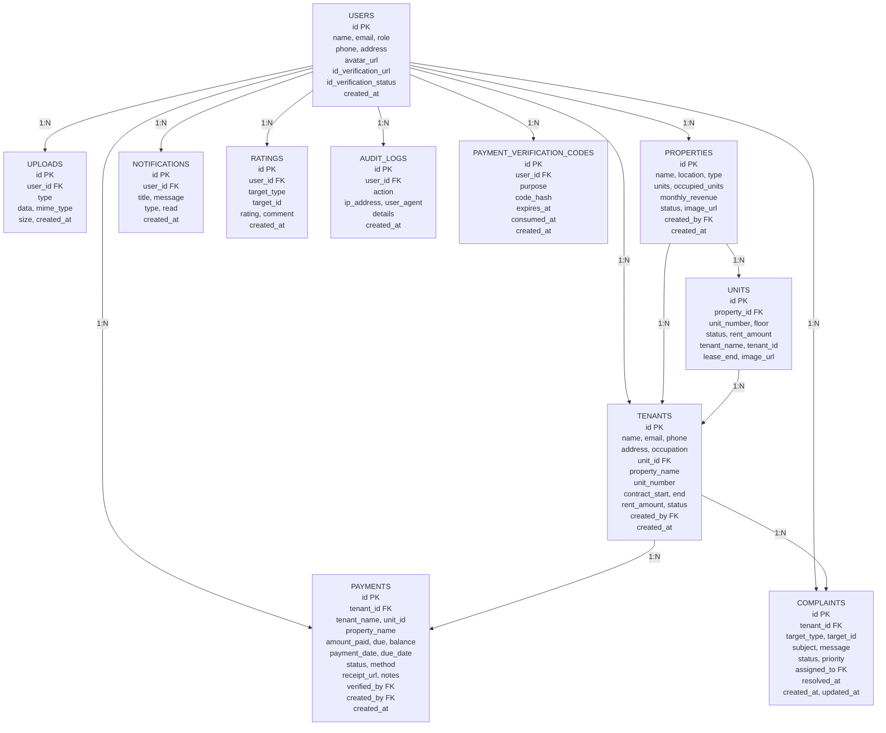

# RentTrack System ERD

## Entity Relationship Diagram



## Tables Overview

| Table | Records | Description |
|-------|---------|-------------|
| **USERS** | All users | Admin, Owner, Agent, Tenant accounts |
| **UPLOADS** | File storage | Avatars, IDs, property images, unit images, receipts |
| **PROPERTIES** | Properties | Registered rental properties |
| **UNITS** | Units | Individual rental units |
| **TENANTS** | Tenants | Tenant records |
| **PAYMENTS** | Payments | Payment transactions |
| **NOTIFICATIONS** | Notifications | User notifications |
| **RATINGS** | Ratings | Property/unit ratings |
| **COMPLAINTS** | Complaints | Tenant complaints |
| **AUDIT_LOGS** | Audit trail | System action logs |
| **PAYMENT_VERIFICATION_CODES** | OTP codes | Payment verification codes |

## Relationships

```
USERS (1) ----< (N) UPLOADS
USERS (1) ----< (N) PROPERTIES
USERS (1) ----< (N) TENANTS
USERS (1) ----< (N) NOTIFICATIONS
USERS (1) ----< (N) RATINGS
USERS (1) ----< (N) COMPLAINTS
USERS (1) ----< (N) AUDIT_LOGS
USERS (1) ----< (N) PAYMENT_VERIFICATION_CODES
USERS (1) ----< (N) PAYMENTS

PROPERTIES (1) ----< (N) UNITS
PROPERTIES (1) ----< (N) TENANTS
UNITS (1) ----< (N) TENANTS
TENANTS (1) ----< (N) PAYMENTS
TENANTS (1) ----< (N) COMPLAINTS
```

## User Roles

| Role | Access Level |
|------|-------------|
| **Admin** | Full system access |
| **Owner** | Full system access |
| **Agent** | Tenant management, payment verification |
| **Tenant** | View properties, make payments, submit complaints |
