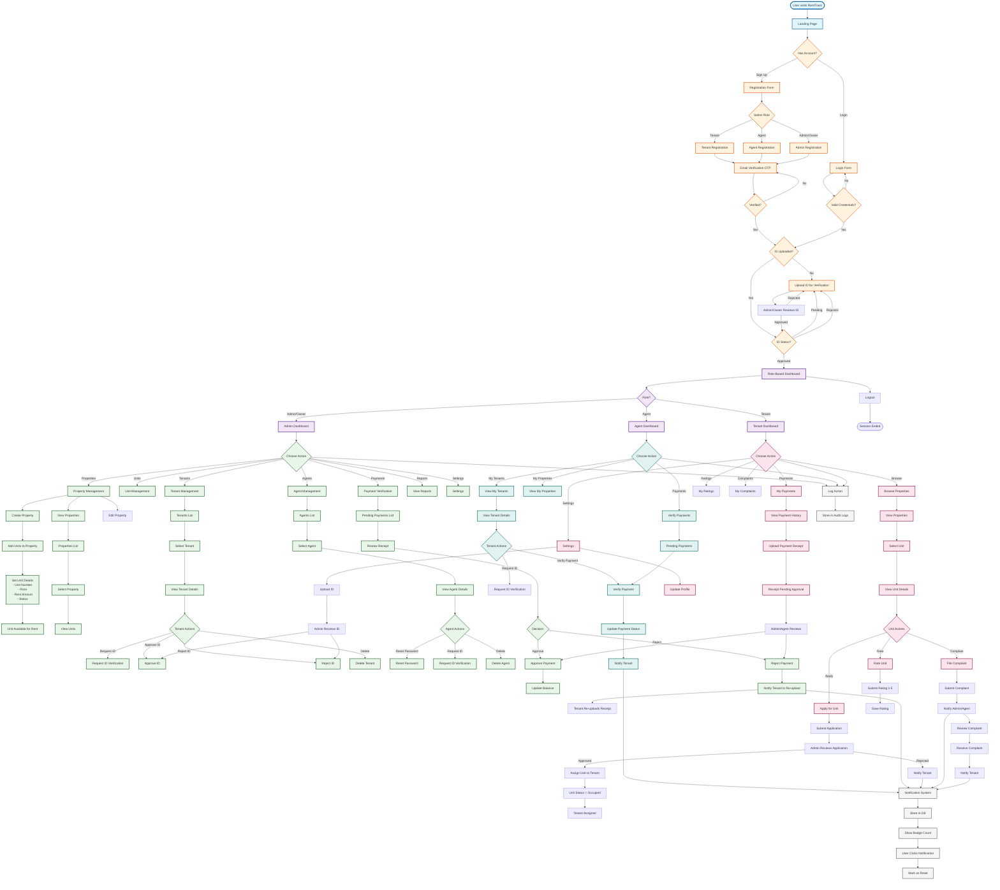
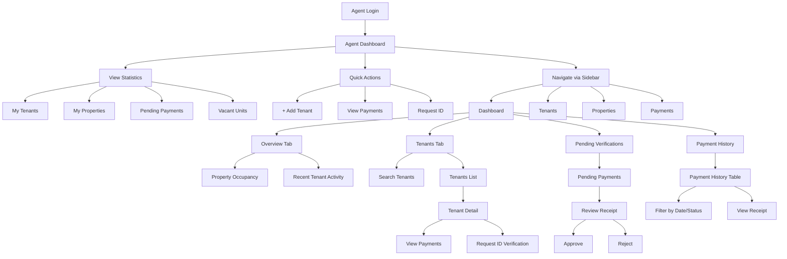
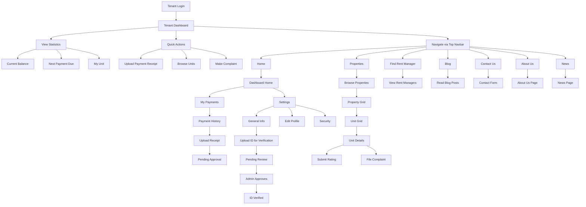
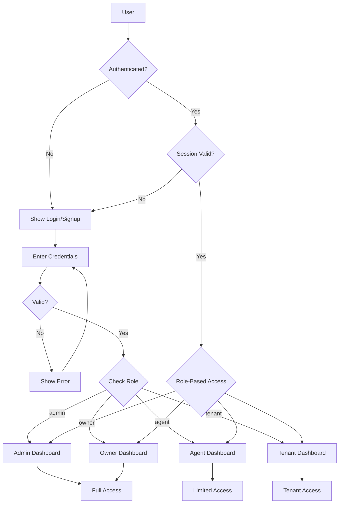
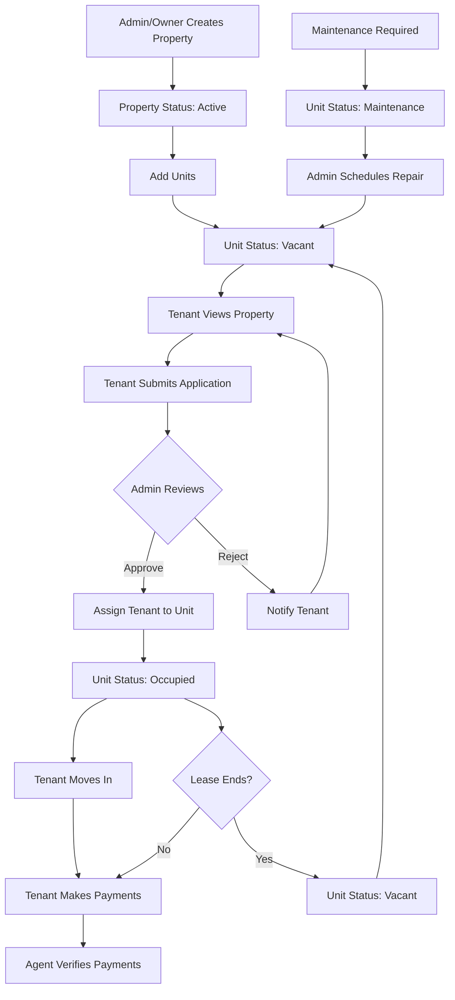
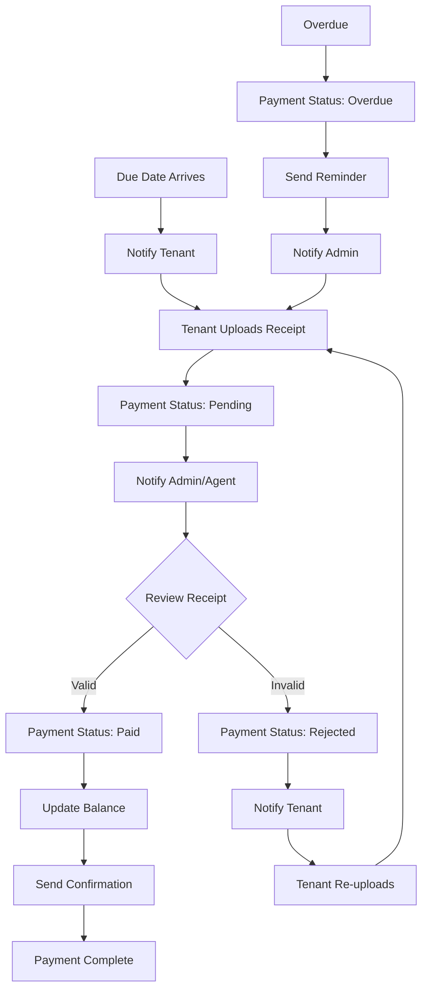
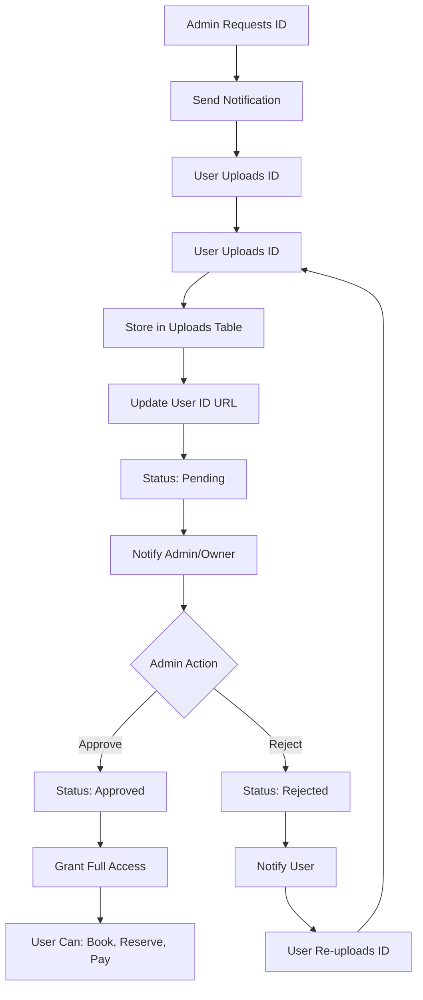
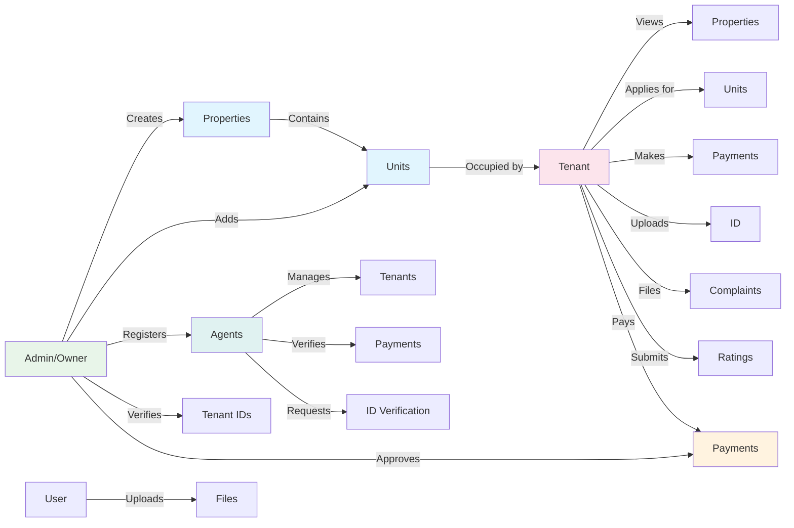
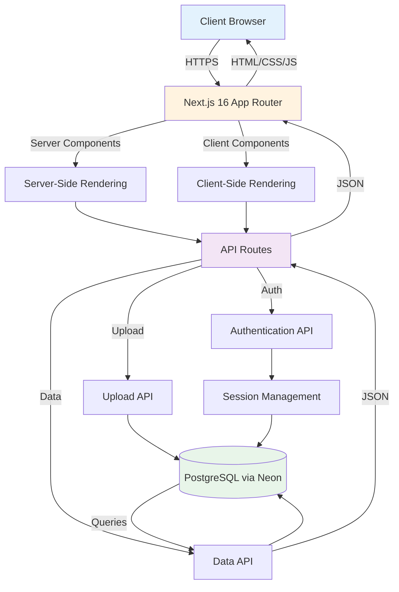

# RentTrack System Flowchart

## Complete System Flow



## User Role Dashboards

### Admin/Owner Dashboard

```mermaid
flowchart TD
    AdminLogin[Admin/Owner Login] --> AdminHome[Dashboard Home]
    AdminHome --> Stats[View Statistics]
    AdminHome --> QuickActions[Quick Actions]
    
    Stats --> TotalProps[Total Properties]
    Stats --> TotalUnits[Total Units]
    Stats --> TotalTenants[Total Tenants]
    Stats --> TotalRevenue[Total Revenue]
    Stats --> PendingVerifications[Pending Verifications]
    
    QuickActions --> AddProperty[+ Add Property]
    QuickActions --> AddUnit[+ Add Unit]
    QuickActions --> AddTenant[+ Add Tenant]
    QuickActions --> ViewPayments[View Payments]
    
    AdminHome --> Sidebar[Navigate via Sidebar]
    Sidebar --> Properties[Properties]
    Sidebar --> Units[Units]
    Sidebar --> Tenants[Tenants]
    Sidebar --> Agents[Agents]
    Sidebar --> Payments[Payments]
    Sidebar --> Reports[Reports]
    Sidebar --> Settings[Settings]
    
    Properties --> PropList[Properties List]
    PropList --> PropDetail[Property Detail]
    PropDetail --> AddUnit2[Add Units]
    PropDetail --> EditProp[Edit Property]
    PropDetail --> DeleteProp[Delete Property]
    
    Units --> UnitList[Units List]
    UnitList --> UnitDetail[Unit Detail]
    UnitDetail --> AssignTenant[Assign Tenant]
    UnitDetail --> EditUnit[Edit Unit]
    UnitDetail --> DeleteUnit[Delete Unit]
    
    Tenants --> TenantList[Tenants List]
    TenantList --> TenantDetail[Tenant Detail]
    TenantDetail --> ViewPayments2[View Payments]
    TenantDetail --> RequestID[Request ID Verification]
    TenantDetail --> DeleteTenant2[Delete Tenant]
    
    Agents --> AgentList[Agents List]
    AgentList --> AgentDetail[Agent Detail]
    AgentDetail --> ResetPassword[Reset Password]
    AgentDetail --> RequestID2[Request ID Verification]
    AgentDetail --> DeleteAgent2[Delete Agent]
    
    Payments --> PaymentList[Payments List]
    PaymentList --> PaymentDetail[Payment Detail]
    PaymentDetail --> VerifyReceipt[Verify Receipt]
    PaymentDetail --> ApprovePayment[Approve]
    PaymentDetail --> RejectPayment[Reject]
    
    Reports --> PaymentReport[Payment Reports]
    Reports --> TenantReport[Tenant Reports]
    Reports --> PropertyReport[Property Reports]
    
    Settings --> Profile[Profile Settings]
    Settings --> Security[Security Settings]
    Settings --> Notifications[Notification Settings]
```


### Agent Dashboard


### Tenant Dashboard


## Core System Flows

### Authentication & Authorization Flow


### Property Lifecycle Flow


### Payment Lifecycle Flow


### ID Verification Flow


## System Interactions

### Cross-Role Interactions



## Technology Stack Flow



## Key Decision Points

| Decision Point | Options | Outcome |
|---------------|---------|---------|
| **User Role** | Admin, Owner, Agent, Tenant | Determines dashboard and permissions |
| **ID Verification** | Pending, Approved, Rejected | Controls access to booking/payment features |
| **Unit Status** | Vacant, Occupied, Maintenance | Determines availability for tenants |
| **Payment Status** | Paid, Pending, Overdue, Partial | Triggers notifications and actions |
| **Complaint Status** | Open, In Progress, Resolved, Closed | Tracks issue resolution |
| **Property Status** | Active, Inactive | Controls visibility to tenants |

## Data Flow Summary

```
User Action → Client Component → API Route → Database Query → Database
                                    ↓
                            Response JSON → State Update → UI Re-render
                                    ↓
                            Notification Trigger → Notify Relevant Users
                                    ↓
                            Audit Log → Record Action
```
